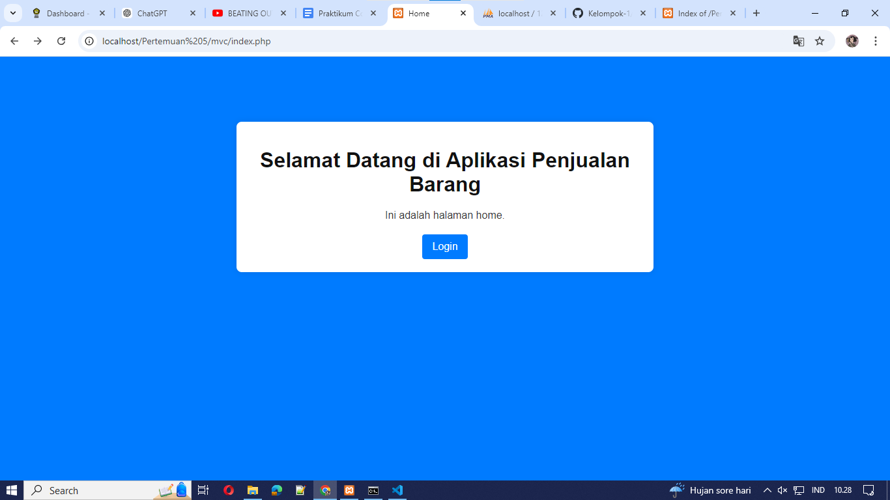
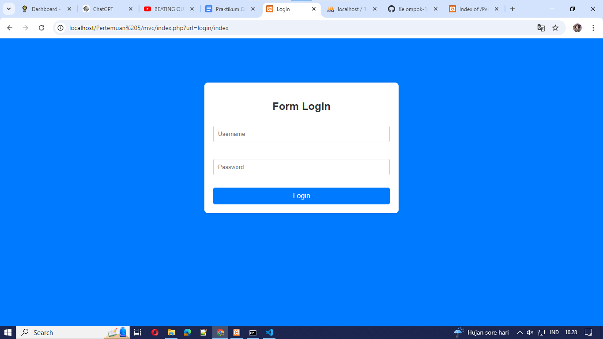
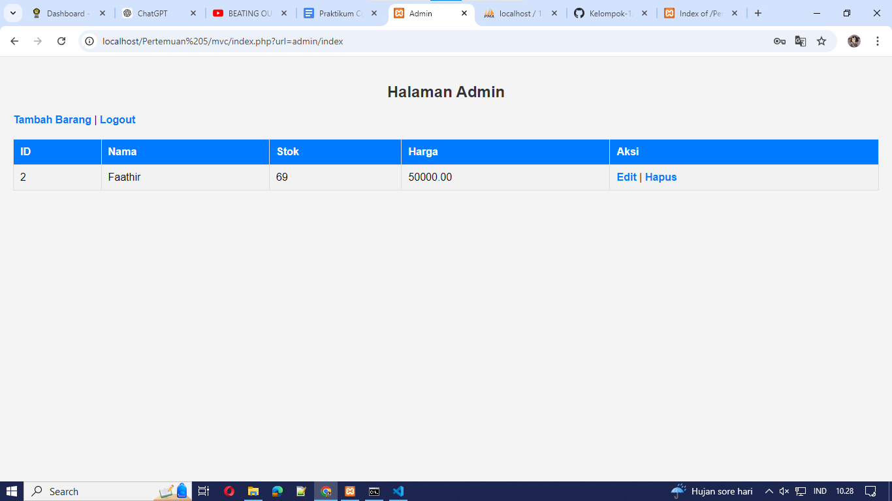
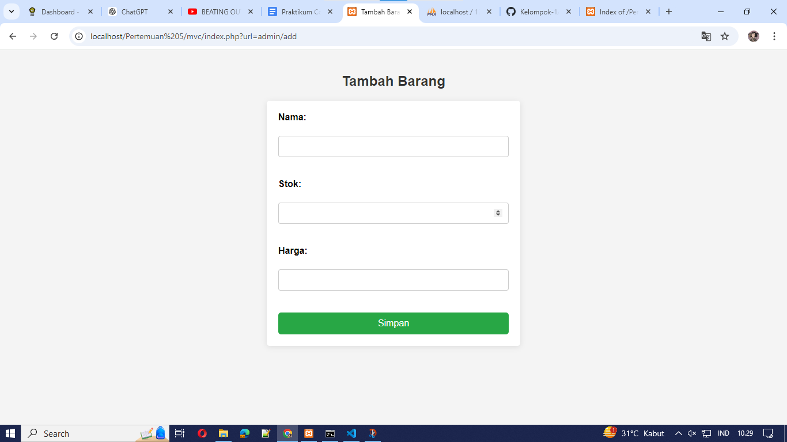
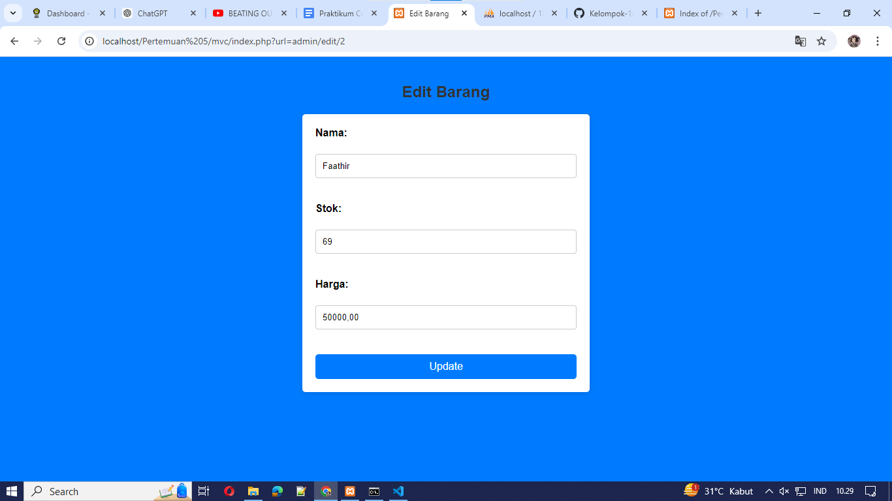

# Laporan Tugas: Aplikasi CRUD Barang

## Pendahuluan

Aplikasi ini adalah implementasi sederhana dari konsep MVC (Model-View-Controller) yang digunakan untuk mengelola data barang dalam sebuah sistem. Dalam proyek ini, pengguna dapat menambahkan, mengedit, dan menghapus barang, serta melakukan login untuk mengakses halaman admin.

## Struktur Proyek

Struktur proyek ini adalah sebagai berikut:


## Memahami MVC dan Routing

### Model-View-Controller (MVC)

- **Model**: Bertanggung jawab untuk mengelola data dan logika bisnis. Dalam aplikasi ini, model tidak ditunjukkan secara eksplisit, tetapi fungsi CRUD (Create, Read, Update, Delete) pada controller mengakses dan memanipulasi data barang.
- **View**: Berfungsi untuk menampilkan data kepada pengguna. File `add.php`, `edit.php`, dan `index.php` di dalam folder `views/admin` adalah contoh view yang menampilkan form dan tabel untuk pengelolaan barang.
- **Controller**: Menghubungkan model dan view, serta menangani permintaan dari pengguna. Controller `AdminController` (tidak ditampilkan secara eksplisit di sini) akan memiliki metode untuk menangani logika CRUD.

### Routing

Routing dalam aplikasi ini dilakukan menggunakan URL yang mengarahkan ke controller dan metode yang sesuai. Contohnya:

- `index.php?url=admin/add` akan mengarahkan ke metode `add` dalam `AdminController`.
- `index.php?url=login/auth` untuk otentikasi login.

## Menggunakan Cookies dan Sessions

Dalam aplikasi ini, kita menggunakan **sessions** untuk menyimpan status login pengguna. Saat pengguna berhasil login, username disimpan dalam session:

```php
$_SESSION['user'] = $username;

### AKHIR LAPORAN

## Screenshot

### Halaman Home



### Form Login



### Halaman Admin



### Tambah Barang



### Edit Barang



## Kontribusi

Dibuat oleh Faathir Akbar Nugroho.

## Lisensi

Projek ini dilisensikan di bawah [MIT License](LICENSE).
